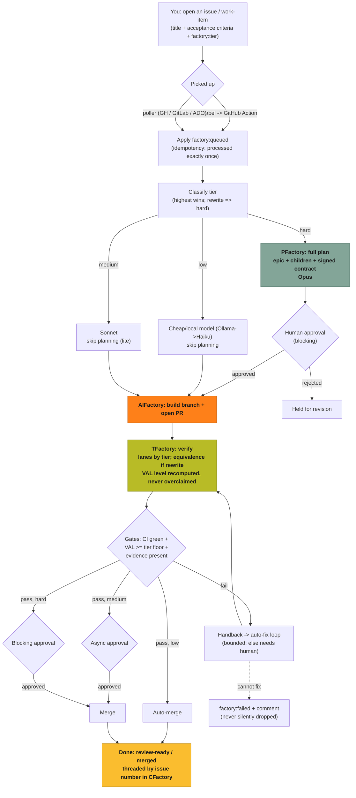

# Creating issues & work-items the Factory can run

This page explains how a piece of work enters the Factory: what you create, what
labels it needs, what the Factory creates from it, how it is processed and why,
and how it is indexed and tracked end to end. It applies to **GitHub Issues,
GitLab Issues, and Azure DevOps work-items** — the mechanism is the same on all
three.

## Why this exists

The Factory turns one **governed unit of work** — an issue/work-item — into a
plan, code, tests, and a review-ready change, with a human in the loop only where
it matters. The issue is the contract with you: it is the single, human-visible
artifact every stage references. Getting the issue right is how you get a correct
result.

Two ideas make it work:

- **The issue number is the correlation key.** Everything the Factory produces
  for your issue — the plan epic, the build branch, the PR, the test run — is
  threaded back to that one number so you can follow it in the CFactory cockpit.
- **A label sets the difficulty tier.** A single label tells the Factory how hard
  the work is, which decides the model used, whether it plans first, whether a
  human must approve, how hard it is tested, and whether it can merge itself.

## What you create (the minimum)

A normal issue with a clear title, a short description, and **acceptance criteria**
(what "done" looks like), plus **one tier label**:

| Label | Use it for | Model | Planning | Human gate | Verification | Merge |
|---|---|---|---|---|---|---|
| `factory:low` | Easy, well-scoped, low-risk | cheap/local (Ollama, else Haiku) | skipped | none | unit (VAL-1) | auto-merges when green |
| `factory:medium` | Moderate; a bit of edge difficulty | Sonnet | skipped | async approval | unit + integration (VAL-2) | merges after you approve |
| `factory:hard` | Hardest; rewrites, design needed | Opus | full PFactory plan | blocking | + mutation/integration (VAL-3); equivalence for rewrites | blocking approval, then merge |

Rules:

- **Highest tier wins** if more than one is present (`hard` > `medium` > `low`).
- A **rewrite/migration** ("port X from Python to Rust") is always treated as
  **hard** and gets a behavioural-equivalence test, regardless of the label.
- Write acceptance criteria as checkable statements. The build is graded against
  them, and for `medium`/`hard` they drive the test plan.

Use the **"Factory task"** issue template (GitHub: pick it when opening an issue;
GitLab: the `factory-task` description template; Azure DevOps: the Factory
work-item template). It prompts for title, context, acceptance criteria, target
repo, and difficulty — and applies the matching `factory:*` label for you.

### Supporting labels (optional / automatic)

- `pfactory`, `handoff:aifactory`, `handoff:tfactory`, `epic` — governance/routing
  markers (usually set by the Factory, not you).
- `type:*` (`type:feature`/`type:bugfix`), `priority:*` — descriptive, carried through.
- `factory:queued` (applied by the Factory when it accepts the issue) and
  `factory:failed` (applied if it cannot complete) — **status markers, do not set
  these yourself.**

## How it is picked up

Two mechanisms, same result:

1. **Instant (GitHub Actions):** labeling an issue triggers a workflow that hands
   it to the Factory immediately.
2. **Polling (all trackers):** a provider-agnostic poller checks your configured
   GitHub/GitLab/ADO projects on an interval for `factory:*`-labelled items that
   are not yet `factory:queued`, and ingests them. This is what gives uniform,
   reliable pickup across all three trackers.

Either way, the Factory applies `factory:queued` the moment it accepts the issue,
so it is **never processed twice** — even if the workflow and the poller both see
it, or the service restarts mid-run.

## What the Factory creates from it

Depending on tier:

- **PFactory (planning, `hard`):** an **epic issue + child issues** decomposed from
  your acceptance criteria, and a signed **Task Contract** (the machine-readable
  WHAT/HOW/VERIFY). For `low`/`medium`, planning is skipped and a lightweight
  contract is built directly.
- **AIFactory (code):** a build **branch** and a **pull request** implementing the
  acceptance criteria.
- **TFactory (verify):** a test run across the lanes the tier requires, producing a
  **verdict** and an honest verification level (VAL-0..VAL-4).
- **CFactory (observe):** one **cockpit card** that threads plan to code to test by
  your issue number.

## How it is processed and why

Why it is shaped this way:

- **Classify before doing anything expensive** so cheap work uses cheap models and
  hard work gets planning + the top model + a human. You do not pay Opus prices for
  a typo, and you do not let a rewrite through on Haiku.
- **Plan only when it is hard.** Easy/medium work skips planning for speed; hard
  work is decomposed and human-approved first because that is where mistakes are
  expensive.
- **Verify to an honest level.** TFactory recomputes the verification level from
  what actually ran and never claims more than it proved; a higher tier raises the
  floor (more lanes, mutation, equivalence for rewrites).
- **Gate the merge by tier.** `low` merges itself only when CI is green and the
  assurance floor is met; `medium`/`hard` wait for a human. Nothing merges on a
  claim — only on evidence.
- **Fail loud, never silent.** If the auto-fix loop cannot make it pass, the issue
  gets `factory:failed` and a comment, so it surfaces for a human instead of
  disappearing.

## How it is indexed and used

- **Correlation key = the issue number.** PFactory stamps it on the epic and the
  contract; AIFactory carries it on the task and the PR; TFactory records it on the
  spec. CFactory uses it to stitch one timeline.
- **Status labels** (`factory:queued`, `factory:failed`) make state visible on the
  issue itself, across every tracker, and survive restarts.
- **The cockpit** (CFactory) shows the live plan -> code -> test -> merge progress
  for each issue, including when it is waiting on you.

## Creating one manually (quick reference)

1. Open an issue/work-item using the **Factory task** template.
2. Fill in title, context, **acceptance criteria**, and the **target repo**.
3. Apply exactly **one** tier label: `factory:low`, `factory:medium`, or
   `factory:hard` (the template does this from the difficulty dropdown).
4. For a rewrite, say so in the body ("port/rewrite X from A to B"); it will be
   treated as `hard` with an equivalence check.
5. Submit. Watch the cockpit card (threaded by the issue number) for progress and
   any approval requests.

## Status / maturity

The unified `factory:low|medium|hard` tiers, the cross-tracker poller, and the
auto-merge policy are landing via **RFC-0011** (label-driven intake & difficulty
tiers). The correlation key, the signed Task Contract, the per-factory label
triggers, and the verification levels are already in place. See
`docs/rfc/0011-label-driven-intake-and-difficulty-tiers.md` for the normative
standard and `docs/rfc/0006-verification-assurance-levels.md` for the VAL ladder.
