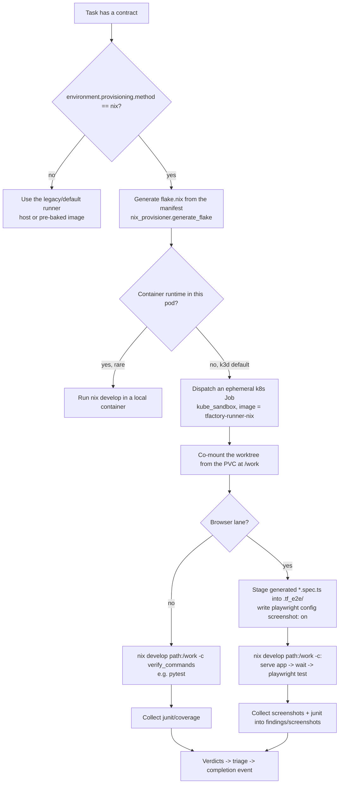
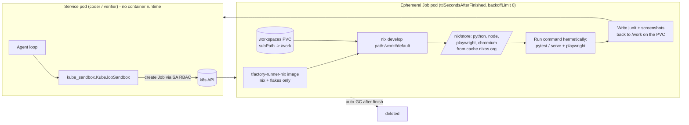

# Reproducible test environments — how the Factory builds and verifies in a per-task Nix flake

This is the operator + team guide for RFC-0005 Tier A: how the Factory provisions a
reproducible, per-task toolchain (including a real browser for screenshots) using a
Nix flake, and runs it inside an ephemeral Kubernetes Job. It explains the end-to-end
flow, the handover between services, how the coding agents create pods, how `flake.nix`
sandboxes the toolchain, and exactly what teams have to do to get screenshots and
green browser tests.

Companion RFCs: [RFC-0005](/rfc/environment-provisioning/) (the design),
RFC-0002 (the Task Contract), RFC-0001a (evidence gates).

## 1. The one-paragraph version

The planner (PFactory) writes an `environment` block into the Task Contract declaring
the toolchain a task needs. Each consumer (AIFactory to build, TFactory to verify)
generates a `flake.nix` from that block and runs its commands with
`nix develop path:/work -c <command>` inside a throwaway Kubernetes Job built on a thin
`tfactory-runner-nix` image. The toolchain — Python, Node, Playwright, the Chromium
browser — comes from the flake (fetched from the Nix binary cache), not from the image.
Because build and verify use the same flake, the two environments cannot drift, and a
browser lane produces real screenshots with no per-language image maintenance.

## 2. End-to-end data and action flow (with handover)

```mermaid
sequenceDiagram
    actor Team as User / Team
    participant PF as PFactory (Planner)
    participant CT as Task Contract
    participant AF as AIFactory (Coder)
    participant TF as TFactory (Verifier)
    participant K8s as Kubernetes (ephemeral Job)
    participant CF as CFactory (Cockpit)

    Team->>PF: Submit spec (acceptance criteria, incl. UI/browser ones)
    PF->>PF: Plan; classify lanes (unit / api / browser)
    PF->>CT: Emit contract + environment manifest<br/>(language, system_packages, verify_commands,<br/>serve_command, provisioning.method=nix)
    PF-->>AF: Hand over signed contract

    AF->>AF: Code the task in a worktree
    opt AIFACTORY_SANDBOX_BACKEND=nixjob
        AF->>AF: Generate flake.nix from contract.environment
        AF->>K8s: Build/verify gate as Nix Job (nix develop path:/work -c)
        K8s-->>AF: gate pass/fail
    end
    AF->>AF: Push build branch
    AF-->>TF: Handoff: POST /api/specs/ingest<br/>(git_url + source_branch + contract)

    TF->>TF: Clone/checkout build branch; plan + generate tests
    TF->>TF: Evaluator: materialize flake.nix from contract.environment
    TF->>K8s: Dispatch Nix Job (co-mount worktree at /work)
    K8s->>K8s: nix develop path:/work -> serve app + run lane
    K8s-->>TF: junit + screenshots (written back to the PVC)
    TF->>TF: Triage; collect screenshots into findings/
    TF-->>CF: Completion event (verdicts + evidence)
    CF-->>Team: Cockpit shows verdicts, screenshots, hand-backs
```

## 3. The process logic (decision flow)

This is the logic each consumer follows when it has work to run.



Key decisions, and why:

- `path:/work` (not a bare `/work`): the worktree is a git repo co-mounted into the
  Job. A bare flake reference makes Nix use its git fetcher, which rejects the repo on
  a uid mismatch (Job runs as root, files are uid 65532) and ignores the untracked
  generated `flake.nix`. `path:` copies the directory directly. This was proven the
  hard way against the live cluster.
- Browser screenshots come from the runner, not the test: the Playwright config sets
  `screenshot: 'on'`, so every browser test yields a screenshot even when the generated
  spec never calls `page.screenshot()`.
- Generated specs are staged into a clean `.tf_e2e/` so a stale `*.spec.ts` left in the
  repo cannot be picked up and run against the wrong app.

## 4. How the coding agents create pods, and how flake.nix sandboxes the toolchain

The long-lived service pods (the AIFactory coder loop, the TFactory verify loop) have
no container runtime — they cannot `docker run`. So the *execution* of build/verify
commands is pushed into an ephemeral Kubernetes Job created via the in-cluster API.
The agent loop stays in the service pod; only the toolchain-bearing work runs in the
Job.



What `flake.nix` does as the sandbox boundary:

- It is generated from the contract `environment` manifest, so it is a pure function
  of what the planner declared — committed as a deliverable, identical for build and
  verify.
- `nix develop` realises exactly the pinned dependency closure into `/nix/store` and
  puts only those tools on `PATH`. Nothing leaks in from the image (which carries only
  Nix itself). For a browser lane the flake provides version-matched
  `playwright-test` + `playwright-driver.browsers` and a fontconfig file so headless
  Chromium renders text.
- The Job is the isolation unit: hardened (`restartPolicy: Never`, `backoffLimit: 0`,
  `automountServiceAccountToken: false`, CPU/memory limits), the only writable surface
  is the co-mounted worktree, and it is auto-deleted (`ttlSecondsAfterFinished`).

## 5. What teams and operators must do

Most of this is automatic. The minimum to get green browser tests and screenshots:

1. Write specs with real UI acceptance criteria. The planner routes rendered-page and
   DOM-interaction criteria (page title, headings, button clicks, fetches) to the
   browser lane automatically; nothing special is required beyond describing the UI.
2. Let the planner emit the environment manifest. It is derived from the planned lanes
   (a browser lane adds `chromium` + a Playwright verify command and sets the network
   posture). No manual flake authoring — `flake.nix` is generated from the manifest.
3. (Optional) declare `environment.serve_command` in the contract when the app's start
   command is non-standard. Otherwise the verifier auto-detects it (root `app.py`,
   `src/app/main.py`, `main.py` via uvicorn, or a `package.json` start script).
4. Operators: keep the Nix lane enabled (see the per-repo docs for the exact env vars
   and RBAC). TFactory's verify side is enabled in gitops; AIFactory's build side is
   opt-in via `AIFACTORY_SANDBOX_BACKEND=nixjob`.

You do NOT need to: hand-write `flake.nix`, add screenshot calls to generated tests,
install browsers, or maintain per-language runner images.

## 6. Where each piece lives

| Concern | Module / artifact |
| --- | --- |
| Contract `environment` block (+ `serve_command`) | `apis/task-contract.schema.json` (`$defs.environment`) |
| Flake generator + `nix develop` argv | `scripts/nix_provisioner.py` (vendored into TFactory + AIFactory) |
| Planner emits the manifest | PFactory `plan/emit/environment_block.py` |
| Verifier materialize + browser evidence | TFactory `agents/nix_env.py` |
| Ephemeral Job backend | TFactory `tools/runners/kube_sandbox.py` (ported from AIFactory `core/kube_sandbox.py`) |
| Nix runner image | TFactory `docker/tfactory-runner-nix/` -> `ghcr.io/<owner>/tfactory-runner-nix` |
| Build-side Nix gates | AIFactory `agents/gate_runner.py` (`nixjob` backend) + `core/nix_env.py` |

See the per-repo guides for the role-specific view and the exact adoption steps.

## 7. Trust: the plan is verified buildable and testable before we build

The environment manifest is only as trustworthy as the plan it derives from. PFactory
does not emit a contract on a hunch — every plan passes a **hard readiness gate** of
named checks (does every acceptance criterion map to work? are dependencies sound? is
required access granted? are there blocking security/policy findings? did the
decomposition use the model or fall back?). Each check emits a pass/fail with a reason,
a remediation, and evidence; a high review score cannot mask a missing-information
blocker; and overriding a hard fail requires a recorded, audited human waiver. The
contract is then HMAC-signed so AIFactory and TFactory verify they are acting on the
exact plan that passed.

This is the answer to "why should we trust what the Factory says it does": the choices
are small named functions you can read, coverage of acceptance criteria is explicit,
failures stop emission, and model use is bounded and surfaced. The full, code-grounded
explanation (with the planning + readiness-gate diagrams) is in PFactory's
"Planning and Trust" guide. TFactory then independently verifies the generated tests
against the real built code — so the plan's promises are checked, not trusted blindly.
