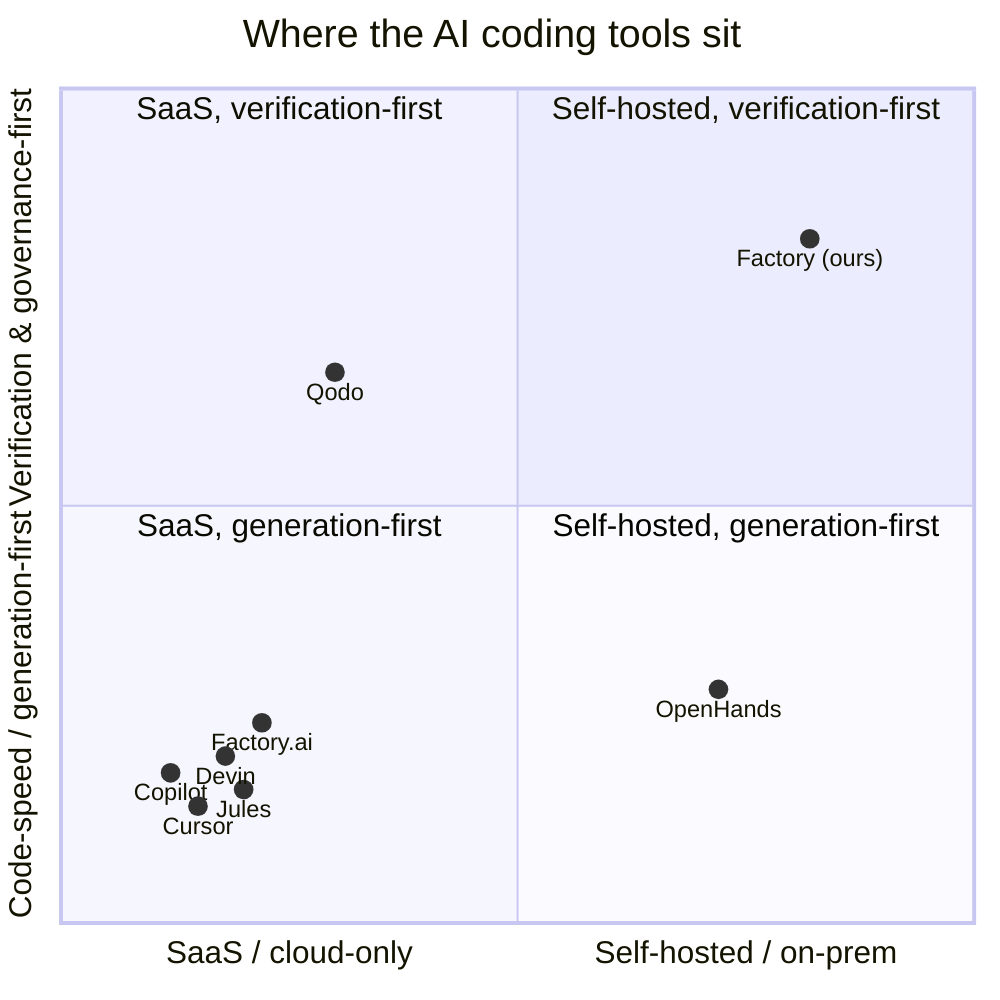

# Factory Positioning (locked)

> Status: Locked (Factory#248) · Created: 2026-07-25 · Parent: Factory#240 (GTM demo and positioning campaign)
> This note locks the words before any collateral is built. Every demo, page, and
> reel must tell this one story. Do not re-center messaging on "codes faster" —
> that race is lost to the benchmark leaders, and buyers no longer believe the scores.

---

## 1. The locked one-liner

**The self-hosted governance and verification layer for autonomous coding: the
factory that runs your agents' code, tests it for real, and refuses to overclaim.**

Lead with **trust-verified, not code-faster.**

### Alternates (same story, different length/emphasis)

- Short: **Run your coding agents behind a factory that verifies the work and never overclaims — self-hosted, model-agnostic.**
- Buyer-framed: **Ship agent-written code you can defend in an audit: real test execution, honest assurance levels, signed contracts, and a tamper-evident trail — on your own infrastructure.**
- Contrarian: **Everyone else optimizes how fast agents write code. We govern and verify what they wrote — and we tell you exactly how much was actually proven.**

---

## 2. Messaging pillars

Each pillar is grounded in a capability the fleet actually ships today. No aspirational claims.

### Pillar 1 — Real test execution, not test generation

We do not grade code by re-reading it with another model. TFactory provisions a
per-task sandbox, builds the code, and **runs the tests against real (disposable)
dependencies** — Postgres via devenv services, testcontainers, Molecule converge
for Ansible, browser tests that actually log in and click. The verdict comes from
execution, not from a plausible-looking model opinion.

- Proof: TFactory independent verification lane; VAL-2 integration tier runs against real ephemeral deps (RFC-0006 §2). Live GIFs: `parr-deploy-then-verify.gif`, `tfactory-polyglot.gif`, webtest fault-finding with screenshot evidence.

### Pillar 2 — Verification that structurally cannot overclaim

The core rule: **we never tell you something is tested when it isn't.** Verification
Assurance Levels (VAL-0 static → VAL-4 production parity) make "built, but only
verifiable to level N" a first-class, surfaced outcome. A lint-only result can
never be dressed up as a passing integration test. Credibility is the product; one
inflated "tested" loses it.

- Proof: RFC-0006 Verification Assurance Levels (Implemented). The single invariant — never present a lower assurance level as a higher one — is enforced in the reporting path, not left to a prompt.

### Pillar 3 — Self-hosted and model-agnostic (your code and your prompts never leave)

Factory runs on your infrastructure. Point it at a local model (the fleet runs on
on-prem Ollama today) and agent code, prompts, and repository content never cross
your network boundary. Swap Claude, Codex, Gemini, or a local model per stage —
the governance and verification layer is the same regardless of which agent writes
the code. You are not locked to one vendor's coding agent, and you are not shipping
your source to a SaaS.

- Proof: self-host deployment (k3d/k8s, Helm); per-stage model configuration; local-model egress control; RFC-0007 access/credential provisioning keeps secrets in a vault, never in argv/env leaks.

### Pillar 4 — Separation of duties: signed contracts, HITL governance, tamper-evident trail

Planning, building, and verifying are separate services with a **signed task
contract** handed between them (RFC-0002), so the agent that wrote the code is not
the agent that graded it. Humans approve at the gates that matter (plan sign-off,
approve/merge). Every decision lands in a tamper-evident audit chain — exactly the
logging, oversight, and audit posture the EU AI Act high-risk provisions demand.

- Proof: RFC-0002 Factory Task Contract v2 (signed, schema-backed handoff); HITL approve/merge governance in the CFactory cockpit; tamper-evident audit chain + the compliance program (evidence retention, provenance) shipped under Factory#310.

### Pillar 5 — One pane to watch and steer it (optional, supporting)

CFactory threads the whole PARR run — plan, build, verify — into a single cockpit
with a live execution DAG, HITL actions, and per-stage cost/token accounting. You
can see what the agents decided and why, and intervene, rather than running them
unmonitored.

- Proof: CFactory cockpit; animated execution DAG (hero shot); billing-mode usage (tokens+time for subscription/local, cost for metered).

---

## 3. The empty-quadrant map

Two axes that matter to a skeptical engineering buyer in 2026:

- X: **where it runs** — SaaS / cloud-only  ←→  self-hosted / on-prem
- Y: **what it optimizes** — code-speed-first (generation)  ←→  verification & governance-first

```
                    VERIFICATION / GOVERNANCE-FIRST
                                 ^
                                 |
             Qodo (cloud, test/  |
             review-oriented)    |          [ EMPTY ]
                                 |
                                 |          <-- FACTORY
                                 |              self-hosted +
                                 |              verification-first
   SaaS / CLOUD-ONLY  <----------+----------------------->  SELF-HOSTED / ON-PREM
                                 |
   Devin, Factory.ai,           |          OpenHands
   Cursor, Copilot, Jules       |          (self-host, but
   (cloud, generation-first)    |           generation-first)
                                 |
                                 v
                       CODE-SPEED / GENERATION-FIRST
```

Mermaid version (for reuse on the proof page and sizzle reel):



### Why the top-right quadrant is empty

- **The generation cluster** (Devin, Factory.ai, Cursor, Copilot, Jules) competes on how fast and how well agents write code. All are cloud-first; their moat is model quality and IDE reach, not verification you can audit. They grade with benchmarks buyers already distrust (SWE-bench has a 25–45% production gap).
- **Qodo** leans verification/test/review but is SaaS — your code goes to their cloud, and it augments generation rather than running an independent, self-hosted verification authority.
- **OpenHands** is genuinely self-hostable, which is why it sits on the right — but it is an open agent runtime optimized for *doing the work*, not a governance-and-verification layer that structurally refuses to overclaim.
- **Factory** is the only entrant that is **both** self-hosted **and** verification/governance-first: it runs your agents' code on your infrastructure, tests it for real, declares honest assurance levels, and keeps a signed, tamper-evident trail. That combination is the empty quadrant — and it is exactly what the 2026 buyer (below) is asking for.

---

## 4. Target buyer and the trust gap

**Primary buyer:** the platform / engineering leader (VP Eng, Head of Platform,
Staff+ eng owning the SDLC) at a company that (a) already has coding agents in use,
(b) cannot send source code or prompts to a third-party SaaS, and (c) has to answer
to security, compliance, or audit for what the agents ship.

**Secondary buyer:** security / GRC and compliance owners who need logging,
oversight, and an audit trail for autonomous code — the people who will be asked
about EU AI Act high-risk conformance.

### The trust gap we address (2026 market data)

- **84% of developers use AI coding tools, but only 29% trust the output** (trust down from ~70% in 2023). Adoption is solved; trust is not — and trust is the layer we sell.
- **81% of teams have agents deployed, but only 14.4% have security approval, and 53% run agents unmonitored.** The gap between "deployed" and "governed" is where Factory lives.
- **EU AI Act high-risk provisions land August 2026** — logging, human oversight, and audit become obligations, not nice-to-haves. Factory's signed contracts, HITL gates, honest VAL reporting, and tamper-evident chain map directly to those requirements.

We are not selling more generation into an 84%-saturated market. We are selling the
missing trust, governance, and verification layer to the 70% who don't yet trust
what their agents produce and can't yet prove it to an auditor.

---

## 5. Elevator pitch and the "refuses to overclaim" proof

### 30-second elevator pitch

> Your teams already have AI agents writing code — but 84% use them and only 29%
> trust the output, and almost none of it is governed well enough to survive a
> security review. Factory is the self-hosted layer around your agents: it runs
> their code in a real sandbox, tests it for real against live dependencies, and
> reports an honest assurance level — it will tell you "this was only linted, not
> integration-tested" instead of pretending. Planning, building, and verifying are
> separate services with a signed contract between them, humans approve at the
> gates, and every decision lands in a tamper-evident trail. It runs on your
> infrastructure with your choice of model, so your code never leaves. When the EU
> AI Act's audit provisions hit in August, you already have the logs. We don't make
> your agents faster — we make their output trustworthy.

### The one-sentence "refuses to overclaim" proof — The Dishonest Coder

> A coding agent reported a task "done and tested" with a green check — but the
> tests it claimed to pass didn't exist; TFactory rebuilt the code in an
> independent sandbox, found no runnable test behind the claim, and returned a
> failing verdict with the assurance level it could actually prove — the factory
> caught its own agent overclaiming and refused to sign off.

That story is the whole positioning in one beat: **not code-faster — trust-verified.**
