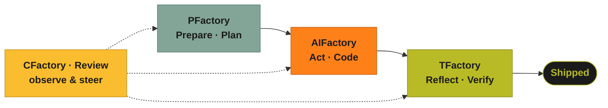

  
An idea in. Shipped, tested software out.

  <h1>One factory. Four products. A pipeline you can govern.</h1>
  
The <b>Factory</b> family turns a plan into <b>merge-ready, verified</b> software
  through a chain of autonomous services — each useful on its own, each built to hand off to the
  next, all following the <b>PARR</b> loop.

  

    PFactory · Prepare
    AIFactory · Act
    TFactory · Reflect
    CFactory · Review
  

  
P<b>Prepare</b>PFactory plans &amp; governs — grounded in your real infrastructure.

  
A<b>Act</b>AIFactory turns governed issues into merge-ready code.

  
R<b>Reflect</b>TFactory generates &amp; grades tests on a 5-signal verdict.

  
R<b>Review</b>CFactory observes the whole pipeline and steers it — with you in the loop.

This is the repository for the **whole program** — cross-cutting plans, the shared
pipeline, and the place the four products come together.

 **New:** [**The Guarded PARR Pipeline**](/pipeline/) — every step and decision
from handover to merge, the sixteen guards that protect task & execution, and
real adoption scenarios from solo builders to regulated enterprises.

---

## The products {#products}

Prepare / Plan + Review

### PFactory — governed planning, grounded in your infrastructure

The planning layer that sits **in front of** coding agents. It ingests plans,
enriches them with **live** organizational context (Kubernetes, AWS/Azure/GCP,
Backstage, internal wikis), runs architecture / security / feasibility review
gates **with citations**, records human approval, and emits governed GitHub issues.

- Context-grounded planning from real cloud + catalog state
- Hybrid deterministic + LLM review gates, every verdict cited
- Human-approval gate before any work is emitted
- Kanban board, feasibility &amp; cost estimates, living templates

  <figure><figcaption>portal — plans overview</figcaption></figure>
  <figure><figcaption>enrich → decompose → review pipeline</figcaption></figure>
  <figure><figcaption>review gates with citations</figcaption></figure>
  <figure><figcaption>human approval gate</figcaption></figure>

[See the full PFactory tour →]({{ '/pfactory/' | relative_url }}) · [Visit PFactory →](https://pfactory.freundcloud.com/) · [GitHub](https://github.com/olafkfreund/PFactory)

Act

### AIFactory — spec-first execution that ships merge-ready code

The **swappable execution core** — the Act stage of the pipeline. A planner writes a
reviewable spec, a coder implements it in an isolated git worktree, and a QA agent
validates against the spec — multi-provider, able to **delegate** to GitHub Copilot
or GitLab Duo, and enterprise-grade. Because Prepare, Reflect and Review live in
separate products, the engine that actually writes code can be replaced without
touching the governance, verification or observability around it.

- Spec-first: every run starts from a written, editable spec
- Isolated worktrees — nothing touches main until you merge
- Multi-provider, per-phase model selection; MCP control plane
- Enterprise: SAML/SCIM, tenant isolation, audit, LiteLLM gateway

  <figure><figcaption>mission control — the PARR pipeline over the board</figcaption></figure>
  <figure><figcaption>the PARR loop, streamed live</figcaption></figure>
  <figure><figcaption>per-task token &amp; resource observability</figcaption></figure>
  <figure><figcaption>live agent console — QA suite passing</figcaption></figure>

[See the full AIFactory tour →]({{ '/aifactory/' | relative_url }}) · [Visit AIFactory →](https://aifactory.freundcloud.com/) · [GitHub](https://github.com/olafkfreund/AIFactory)

Reflect / Review

### TFactory — tests you can trust, not just a green bar

Autonomous test generation + execution across modality lanes (unit, browser, API,
integration, mutation). It grades every generated test on a **5-signal verdict** —
coverage delta, stability re-runs, mutation kills, lint, semantic relevance — and
posts a ranked triage report to your PR.

- Five-signal verdict: meaningful tests, not coverage theatre
- Modality lanes with real evidence (screenshots, video, HAR, mutants)
- Bidirectional handback: failures route back to AIFactory's QA fixer
- Works from any AC source (markdown / Gherkin / EARS) or MCP

  <figure><figcaption>unit lane — generate, run, grade</figcaption></figure>
  <figure><figcaption>polyglot — one spec, many languages</figcaption></figure>
  <figure><figcaption>API lane with HAR evidence</figcaption></figure>
  <figure><figcaption>graded, ranked triage report</figcaption></figure>

[See the full TFactory tour →]({{ '/tfactory/' | relative_url }}) · [Visit TFactory →](https://tfactory.freundcloud.com/) · [GitHub](https://github.com/olafkfreund/TFactory)

Review / Observe &amp; Steer — new

### CFactory — the control tower over all three

The newest member and the piece that turns the others into a **suite**. CFactory
threads every unit of work across the three services into one `WorkItem` (keyed by
GitHub issue), shows it on a single live cockpit, and adds an **agentic copilot**
that explains pipeline state and proposes human-confirmed actions.

- One pane of glass: where is every feature across plan → code → test
- Agentic copilot: "why is #182 stuck?", answered from real cross-service state
- Advise + confirm: the copilot prepares actions; a human always clicks
- Built on the family skeleton; reuses AIFactory's enterprise security

  <figure><figcaption>mission control — Plan · Code · Test, live</figcaption></figure>
  <figure><figcaption>one work item threaded by GitHub issue</figcaption></figure>
  <figure><figcaption>agentic copilot — advise &amp; confirm</figcaption></figure>
  <figure><figcaption>HMAC-chained audit of every action</figcaption></figure>

[See the full CFactory tour →]({{ '/cfactory/' | relative_url }}) · [CFactory on GitHub →](https://github.com/olafkfreund/CFactory)

---

## How they cooperate {#cooperation}

The products are independently useful, but their real power is the **handoff
chain** — the cooperation we're building out:

1. **PFactory → AIFactory.** PFactory emits governed GitHub issues; AIFactory picks
   them up and builds, carrying the issue number as provenance.
2. **AIFactory → TFactory.** A finished feature on a branch is handed to TFactory,
   which generates and grades a test suite against the acceptance criteria.
3. **TFactory → AIFactory (handback).** When tests fail, TFactory routes a
   correction request back to AIFactory's QA fixer — a bounded, closed loop.
4. **CFactory over everything.** A shared **correlation key — the GitHub issue
   number** — threads `plan → code → branch/PR → tests`, so CFactory can show and
   steer the whole pipeline from one place.

flowchart LR
    PF["PFactory"] -- "issue #" --> AF["AIFactory"]
    AF -- "branch / PR · issue #" --> TF["TFactory"]
    TF -. "handback" .-> AF
    C["CFactory observes every step · threads by issue #"] -.-> PF
    C -.-> AF
    C -.-> TF
    classDef pf fill:#83a598,stroke:#5f8175,color:#1b1b1b,font-weight:bold;
    classDef af fill:#fe8019,stroke:#c4641a,color:#1b1b1b,font-weight:bold;
    classDef tf fill:#b8bb26,stroke:#8d9020,color:#1b1b1b,font-weight:bold;
    classDef cf fill:#fabd2f,stroke:#c69526,color:#1b1b1b,font-weight:bold;
    class PF pf; class AF af; class TF tf; class C cf;

The connective tissue — a shared correlation key, a normalized completion-event
schema, and a canonical local port map — is tracked as the **PARR-spine epic** in
this repo.

[See the full architecture →](/architecture/) · [Program roadmap →](/roadmap/) · [Follow the blog →](/blog/)
