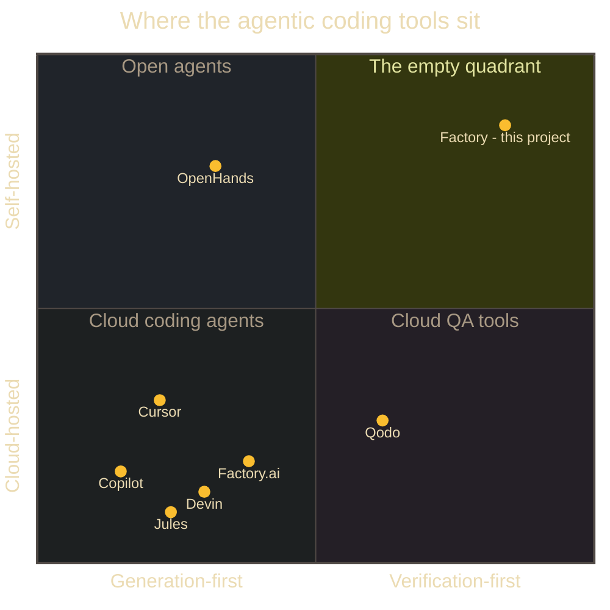

# Proof, not promises

Every coding agent claims its output works. This page is about what the
Factory can <strong>prove</strong> — with executed tests, graded verdicts, screenshots,
signed hand-offs and a standing regression suite — and, just as deliberately, about the
things we do <strong>not</strong> claim yet.

## The position

**The self-hosted governance and verification layer for autonomous coding:** the factory
that runs your agents' code, tests it for real, and refuses to overclaim.

Four pillars carry that sentence. Everything on this page is evidence for one of them:

1. **Real test execution, not test generation.** Tests are run against the actual
   changed code in a disposable environment — and graded, not just counted.
2. **Verification that structurally cannot overclaim.** The Verification Assurance
   Level (VAL) ladder records what was *actually executed*; the claim is computed from
   the evidence, never typed by a model.
3. **Self-hosted and model-agnostic.** Runs on your cluster, with your models —
   Claude, OpenAI, Gemini, Copilot, Codex or a local Ollama — swapped by configuration.
4. **Separation of duties, signed contracts, humans in the loop.** The service that
   plans is not the service that codes is not the service that verifies; every hand-off
   is an HMAC-signed contract, and approval gates sit where auditors expect them.

We deliberately do not compete on "codes faster." The generation race is crowded and
commoditizing; the empty space in the market is below-left of nobody:

Devin, Jules, Copilot and Factory.ai generate in someone else's cloud. Cursor generates
in your editor with cloud models. Qodo grades quality but lives in the cloud. OpenHands
self-hosts but is generation-first. **Self-hosted and verification-first is empty — that
is where this project sits.**

The market context says that quadrant is where the pain is:

  
<b>84% / 29%</b>developers using AI coding tools vs those who trust the output — trust is falling while adoption climbs

  
<b>81% / 14.4%</b>organizations that have deployed AI coding agents vs those whose security teams have approved that use

  
<b>Aug 2 2026</b>EU AI Act high-risk obligations: logging, human oversight and audit evidence become mandatory

For the longer market argument, see [Why Factory](/why/).

---

## What we can prove that others do not

Each item below is a mechanism competitors do not ship, with a pointer to where you can
watch it working — a blog post with screenshots, a demo recording, or the reference spec.

1 · The VAL ladder
### A verdict that names exactly what was executed

Every verified task carries a Verification Assurance Level: **VAL-0** (static analysis
only), **VAL-1** (unit tests executed), **VAL-2** (integration against real but
disposable dependencies — an ephemeral Postgres, a Molecule container, a `terraform plan`),
**VAL-3** (applied against a disposable prod-like target). The achieved level is computed
from the evidence ledger — which commands ran, against which commit, with what output.
If verification is skipped, the result is recorded as VAL-0 at best; it can never be
presented as "tested". A VAL-2 result is rendered so it cannot be mistaken for VAL-3.

Most tools give you a green checkmark. The VAL ladder tells you *which* green checkmark.

See: <a href="/rfc/verification-assurance/">RFC-0006 — Verification Assurance Levels</a> ·
<a href="/blog/2026/06/20/earning-the-right-to-run-unattended/">Earning the right to run unattended</a> ·
<a href="/blog/2026/06/17/seeing-the-proof-test-evidence-in-the-cockpit/">Test evidence in the cockpit</a>

2 · The mutation signal
### Tests graded on whether they would catch a bug

TFactory does not count tests; it grades them on five signals — **coverage delta,
stability across repeated runs, mutation score, lint quality and semantic relevance** to
the acceptance criteria. The mutation signal is the honest one: TFactory injects faults
into the code under test and checks that the generated tests *fail*. A suite that stays
green while the code is deliberately broken is scored down, whatever its coverage number
says. That is the difference between "tests were generated" and "tests would catch a
regression".

  <figure>
    
    <figcaption>TFactory generating, executing and grading a test suite on the 5-signal verdict</figcaption>
  </figure>

See: <a href="/tfactory/">TFactory</a> ·
<a href="/blog/2026/06/12/the-honest-scorecard/">The honest scorecard</a>

3 · MFA-honest UI testing
### Browser tests that log in like a real user — one-time codes included

When acceptance criteria hide behind authentication, TFactory does not mock the login.
It drives a real browser through the real Keycloak flow — username, password, **TOTP
one-time code** — then exercises the UI and records screenshots and screen recordings as
evidence. We proved it on our own product: TFactory logs into all four Factory portals
through MFA and tests every menu and dialog. We also proved it against a deliberately
buggy app deployed to real AWS: the browser test logged in, found the planted validation
fault, and screenshotted it.

  <figure>
    
    <figcaption>The browser test at the real TOTP challenge — no mocked auth</figcaption>
  </figure>
  <figure>
    
    <figcaption>Catching a planted fault in a live, authenticated app on AWS</figcaption>
  </figure>

See: <a href="/blog/2026/06/26/tfactory-tests-the-factory/">The test factory tests the factory</a> ·
<a href="/blog/2026/06/18/demoing-the-factory-mfa-plan-to-proof/">One MFA-gated change, from plan to proof</a> ·
<a href="/blog/2026/06/11/testing-authenticated-web-apps/">Logging into a live web app and finding the bug</a>

4 · Signed contracts and separation of duties
### Hand-offs a compliance team can replay

The planner, the coder and the verifier are separate services with separate credentials.
Work moves between them as a **task contract** — a versioned, schema-validated document
whose hand-offs are HMAC-signed and anchored in an audit log, correlated end to end by
one key (the GitHub issue). Nothing reaches a merge without passing the pipeline's
guards: bounded fix loops, human-approval gates, and completion events that record what
was claimed, by whom, with what evidence. The service that wrote the code cannot also be
the service that vouches for it.

See: <a href="/pipeline/">The guarded PARR pipeline</a> ·
<a href="/rfc/task-contract/">RFC-0002 — the task contract</a> ·
<a href="/blog/2026/06/11/the-guarded-parr-pipeline/">The guards behind the pipeline</a>

5 · A standing regression suite
### Verification that keeps running after the task is done

A passing verdict is a statement about one moment. TFactory's continuous-regression
system re-executes accumulated suites on a nightly schedule and on demand — with retry
and quarantine for flaky tests, drift detection when behavior changes under it, and
impact analysis linking failures back to the change that caused them. Verdicts age;
the regression suite is how we notice.

See: <a href="/rfc/regression-suite-and-continuous-verification/">RFC-0018 — regression suite and continuous verification</a> ·
<a href="/tfactory/">TFactory</a>

---

## The factory, tested like a product

The numbers behind the mechanisms, on the codebase itself:

  
<b>~2,000</b>tests in TFactory alone — the verifier is itself the most-tested service in the fleet

  
<b>escape corpus</b>the OS sandbox that isolates agent code ships with a suite of known escape techniques it must block

  
<b>byte-exact</b>the never-overclaim verdict function is vendored into consumers with a drift guard: CI fails if any copy diverges from the reference

That last one is worth dwelling on: the function that decides what the factory is allowed
to claim is protected against silent modification the same way a checksum protects a
download. Convenient edits to the honesty logic do not survive CI.

## Watch it run

The flagship recording: one brief goes in, and the pipeline plans it, builds it, deploys
it to real cloud infrastructure, verifies it against the live endpoints, and tears it
down.

  <figure>
    
    <figcaption>Deploy-then-verify on real AWS — the full PARR loop</figcaption>
  </figure>
  <figure>
    
    <figcaption>Polyglot verification — the same ladder across languages</figcaption>
  </figure>

More recorded runs: [deploy-then-verify on AWS](/blog/2026/06/11/deploy-then-verify-on-real-aws/) ·
[a three-tier app on EKS, RDS and ElastiCache](/blog/2026/06/19/three-tier-app-on-aws-with-parr/) ·
[one plan, two clouds](/blog/2026/06/27/one-plan-two-clouds-zero-hands-on-keyboard/) ·
[the portals tour](/tour/) · or download the
[one-page showcase (PDF)](/assets/factory-showcase.pdf).

## What we do not claim

### Read this part too

A proof page that hides its limits is marketing. These are ours, today:

- **Most verified tasks top out at VAL-2.** The default ladder climbs as high as is
  achievable locally and ephemerally — real dependencies, but disposable ones. VAL-3
  (applied against a disposable prod-like target) exists in the spec and has run in
  controlled demos, but it is opt-in, gated on credentials and cost guards, and not yet
  the everyday path. When a task says VAL-2, that is what it means — not "tested in
  production-like conditions".
- **The deployment lane is dry-run.** For infrastructure changes the verifier runs
  `tofu init/validate/plan`, policy scanning and image scanning — it does not apply
  infrastructure changes as part of routine verification. Live applies happened only in
  supervised, cost-guarded demo runs.
- **We do not claim to code faster than the benchmark leaders.** The generation race is
  not our race. Our benchmark work is about honest measurement of the whole
  pipeline, not leaderboard placement.
- **This is an early, open project.** No named customers, no revenue claims. What you
  see on this page is what exists: running code, executed tests, recorded evidence.

We think the caps are the credibility. A system whose verifier is structurally unable to
overclaim should describe itself the same way.

## Sources

Trust and adoption: [Uvik — AI coding assistant statistics](https://uvik.net/blog/ai-coding-assistant-statistics/) ·
[Sonar — State of Code 2026](https://www.sonarsource.com/state-of-code-developer-survey-report.pdf) ·
[DigitalApplied — AI coding adoption statistics 2026](https://www.digitalapplied.com/blog/ai-coding-adoption-statistics-2026-50-data-points).
EU AI Act: [European Commission — regulatory framework for AI](https://digital-strategy.ec.europa.eu/en/policies/regulatory-framework-ai) ·
[artificialintelligenceact.eu](https://artificialintelligenceact.eu/).
Competitor placement reflects each product's published deployment and verification model
as of mid-2026; corrections welcome via
[an issue]({{ site.repo_url }}/issues).

[Why Factory](/why/) · [The pipeline](/pipeline/) · [The tour](/tour/) · [The blog](/blog/)
