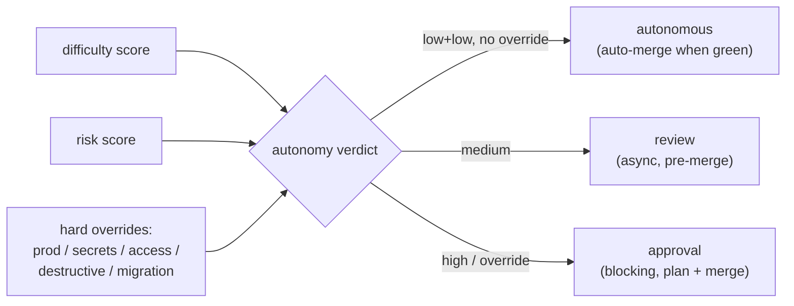
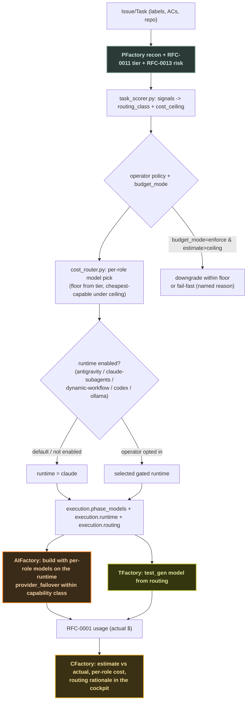

# RFC-0014 — Cost-Aware, Capability-Aware Model & Runtime Routing

> **Status:** Proposed · **Created:** 2026-06-20 · **Extends:**
> [RFC-0002](./0002-task-contract.md) (contract `execution` block),
> [RFC-0011](./0011-label-driven-intake-and-difficulty-tiers.md) (difficulty
> tiers), [RFC-0013](./0013-deployment-aware-planning.md) (risk class),
> [RFC-0008](./0008-autonomous-parr-completion.md) (provider failover) ·
> **Affects:** Factory (catalog+schema), PFactory (score+route), AIFactory
> (runtimes+budget), TFactory (test model), CFactory (cost observability)

## 1. Motivation

Enterprise customers are increasingly cost-wary. The fleet today already chooses
models in three layers — the RFC-0011 difficulty tier
(`low→ollama/haiku · medium→sonnet · hard→opus`), the complexity→model default
in `plan/emit/execution_profile.py`, and a model-string→provider inference in
`phase_config.infer_provider_from_model` feeding a bounded
`provider_failover` chain — **but cost is observe-only**: `execution.budget_usd`
is a soft post-hoc warning that never changes the run, and there is **no
forward-looking router** that picks the cheapest capable model/runtime for a
given task, nor a split that spends a strong model on *planning/governance* and
cheaper models on *coding/testing*.

This RFC adds that missing layer: a **deterministic task scorer** + a
**cost-aware router** that, before execution, selects a per-role model and an
(optionally gated) runtime to fit a cost ceiling — without ever dropping below
the RFC-0011 tier's capability floor. It also makes the higher-throughput
runtimes (Google **Antigravity** agent swarms, **Claude subagents + dynamic
workflows**, **Codex**, local/cloud **Ollama**) first-class but **gated OFF by
default**, so a user can opt in to "go faster / cheaper" deliberately.

## 2. Principles

1. **Capability floor, then cost.** The router may only choose a model/runtime
   **at or above** the RFC-0011 tier's required capability; within that envelope
   it minimizes cost. It never makes a hard task cheap.
2. **Right model for the job, per role.** Planning/governance (the expensive-to-
   get-wrong step) can use a stronger model than coding/testing. Roles:
   `planning`, `coding`, `qa`, `test_gen` — each independently routed.
3. **Gated by construction.** Every non-default runtime (Antigravity, Claude
   subagents, dynamic workflows, Codex, Ollama) is **OFF unless the operator
   enables it** (config + per-task opt-in). The default path is unchanged.
4. **Estimate before, reconcile after.** The router emits a pre-execution cost
   estimate; CFactory compares it to actual spend (RFC-0001 usage). Budget is
   observe-only by default; **enforce** mode is operator-gated.
5. **One price/capability table.** A single hub `model-catalog.json` replaces the
   per-repo duplicated `MODEL_ID_MAP`/price knowledge.

## 3. The model catalog (single source of truth)

`apis/model-catalog.json` (hub) — one entry per known model:

```jsonc
{
  "claude-opus-4-8":   { "provider": "claude",  "class": "frontier", "roles": ["planning","coding","qa"],
                          "price": {"mode": "metered", "in_per_mtok": 15, "out_per_mtok": 75},
                          "caps": {"tools": true, "thinking": true, "context": 200000} },
  "claude-sonnet-4-6": { "provider": "claude",  "class": "balanced", "price": {"mode":"metered","in_per_mtok":3,"out_per_mtok":15}, "caps": {...} },
  "claude-haiku-4-5":  { "provider": "claude",  "class": "cheap",    "price": {"mode":"metered","in_per_mtok":0.8,"out_per_mtok":4}, "caps": {...} },
  "ollama:<model>":    { "provider": "ollama",  "class": "local",    "price": {"mode": "local"} },
  "codex":             { "provider": "codex",   "class": "balanced", "price": {"mode": "subscription"} }
  // gemini / github-models / etc.
}
```

`price.mode ∈ {metered, subscription, local}` mirrors CFactory's billing-mode
display ([[factory-billing-mode-usage]]): only `metered` yields a `$` estimate;
`subscription`/`local` are costed as tokens/time.

## 4. Task scoring → routing class

`PFactory plan/emit/task_scorer.py` (pure, deterministic) reads signals **already
on the plan/contract** and emits a `routing_class` + a cost ceiling:

| Signal | Source |
|---|---|
| difficulty tier | RFC-0011 `autonomy_tier` / `classify_tier` |
| change_mode (migration⇒harder) | RFC-0010 |
| risk_class / production | RFC-0013 `deployment` |
| blast radius / destructive IaC | RFC-0010 recon |
| AC count, file footprint | plan |
| security scope | `tfactory.security_scope` |

`routing_class ∈ {economy, standard, premium, governed}` — `governed` (high
risk/production) forces a frontier model for **planning** even if cheap elsewhere.

## 4b. No effort estimates — difficulty, risk, and the autonomy verdict

**Plans MUST NOT carry effort points, story points, or dev-day/t-shirt
estimates.** With LLM agents a task's wall-clock is minutes-to-hours, not
weeks — sizing in human dev-days is meaningless and misleading. The scorer
therefore emits exactly **two scores plus one verdict**, and the old
`EffortEstimate`/`story_points` surface is removed from PFactory's plan/epic/issue
output (decompose models, `feasibility/effort.py`, `emit/docs/render.py`,
`emit/labels.py`, `agent_api.py`).

The scorer outputs, per task:

- `difficulty ∈ {low, medium, high}` — capability needed (drives the model).
- `risk ∈ {low, medium, high}` — blast radius / reversibility / production /
  security (drives the gate).
- `autonomy ∈ {autonomous, review, approval}` — **can AI ship this alone, or is a
  human needed?** — written to `execution.routing.autonomy` with a `reason`.

**Autonomy decision (difficulty × risk, with hard overrides):**

| autonomy | when | human role |
|---|---|---|
| `autonomous` | difficulty low **and** risk low, not production, no irreversible/destructive/secret/access op, VAL floor met | none — plan→code→test→**auto-merge when green** (RFC-0011 low / RFC-0009) |
| `review` | difficulty medium **or** risk medium | AI executes; human reviews **async before merge** (RFC-0011 medium) |
| `approval` | difficulty high **or** risk high **or** production **or** rewrite/migration **or** security/secrets/access | **blocking** human approval at plan **and** before merge (RFC-0011 hard) |

**Always-human overrides (regardless of score):** production deploy
([RFC-0006](./0006-verification-assurance-levels.md) VAL-4 is never autonomous),
credential/secret changes, access-control changes, destructive data operations,
financial actions. These force `approval` and are enforced by `merge_policy`
([RFC-0009](./0009-ci-gated-auto-merge.md)) + the VAL gates, not just advised.

The verdict reuses the existing wiring — `autonomy_tier` (RFC-0011) already drives
model/planning/merge, `risk_class` (RFC-0013) carries production/risk, and
`merge_policy` enforces the gate — so this RFC makes the verdict **explicit and
effort-free**, it does not invent a new control plane.



## 5. The cost-aware router

`PFactory plan/emit/cost_router.py` runs in `contract_emit.assemble_contract`
**after** `apply_tier` (so the tier floor is already set) and produces, per role,
the cheapest catalog model that (a) meets the tier/class capability floor and
(b) keeps the rolled estimate under the cost ceiling — strong for `planning`/
`governed`, cheaper for `coding`/`qa`/`test_gen`. It writes:

```jsonc
"execution": {
  "phase_models": { "planning": "opus", "coding": "sonnet", "qa": "haiku", "test_gen": "ollama:qwen" },
  "runtime": "claude",                         // default; gated alternatives below
  "routing": {
    "class": "standard",
    "cost_estimate_usd": 2.10,                  // null when subscription/local
    "cost_ceiling_usd": 5.00,
    "policy": "operator-default",
    "rationale": "tier=medium floor=sonnet; planning kept at opus (governed=false→downgradable, kept by policy); coding=sonnet; qa/test downgraded to cheap within floor"
  }
}
```

Additive to RFC-0002; `contract_version` stays `"2"`. Absent ⇒ today's behaviour.

## 6. Gated runtimes

`execution.runtime ∈ {claude, codex, antigravity, ollama, ollama-cloud,
claude-subagents, dynamic-workflow}` — extends the AIFactory provider registry
(`providers/factory.py`) + `provider_failover`. **All non-`claude` runtimes are
disabled unless** the operator sets them in `~/.aifactory/mcp-servers.json`-style
config / env allowlist **and** the contract opts in. `claude-subagents` and
`dynamic-workflow` (parallel sub-agent fan-out / scripted multi-agent
orchestration) are the "speed-up" runtimes — manual enable only, because they
multiply spend.

## 7. Budget enforcement (operator-gated)

`budget_usd` stays observe-only by default. New `execution.budget_mode ∈
{observe, enforce}`: in `enforce` the router refuses a selection whose estimate
exceeds the ceiling (downgrades within the floor, or fails fast with a named
reason if even the floor exceeds it). Never silently degrades a `governed` task.

## 8. How / why / when



**Why:** spend the expensive model where mistakes are costly (plan/governance),
cheap models on mechanical code/test, local/subscription where free — under a
ceiling, never below the capability floor. **When:** at plan-emit, deterministically,
overridable by the contract and operator policy.

## 9. Adoption (tracked by the epic)

Factory: catalog + schema + reference router lib. PFactory: scorer + router.
AIFactory: gated runtime registry + budget enforce mode. TFactory: test-model
consumption. CFactory: cost observability. Plus an E2E proof.
