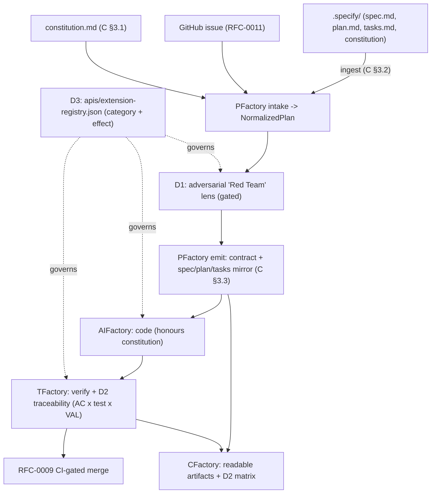

# RFC-0015 — Spec-Driven Interop & Validated-Gap Features (SpecKit-informed)

> **Status:** Proposed · **Created:** 2026-06-20 · **Extends:**
> [RFC-0002](./0002-task-contract.md) (contract artifacts),
> [RFC-0011](./0011-label-driven-intake-and-difficulty-tiers.md) (intake),
> [RFC-0012](./0012-external-knowledge-grounding.md) (house standards / connectors),
> [RFC-0006](./0006-verification-assurance-levels.md) (VAL),
> [RFC-0014](./0014-cost-aware-model-and-runtime-routing.md) (gated runtimes) ·
> **Affects:** Factory (schema + registry), PFactory (constitution, artifacts,
> adversarial review, traceability), AIFactory (constitution consumption),
> TFactory (traceability), CFactory (artifact + matrix views)

## 1. Motivation

GitHub's `spec-kit` (Spec-Driven Development; `specify` CLI, ~114k stars, MIT,
explicitly "an experiment") validates the thesis the Factory fleet is built on:
**the specification — not the code — is the primary artifact**, and an AI agent
transforms spec into implementation. spec-kit's own framing — "Specifications
don't serve code; code serves specifications" — is exactly the PARR premise.

A direct comparison is clarifying. spec-kit is **single-repo, single-developer,
CLI-only, prompt-templates that drive one coding agent**, with **no model of its
own, no CI gating, no independent verification, no deployment or cost awareness**,
and a **constitution enforced only by prompt-reference, not a hard gate**. The
Factory fleet already does all of that and more — PFactory plan/govern, AIFactory
code, TFactory independent verify, CFactory observe, a Task Contract richer than
spec-kit's `spec.md`+`plan.md`+`tasks.md`, plus CI-gated auto-merge (RFC-0009),
Verification Assurance Levels (RFC-0006), deployment-aware planning (RFC-0013),
and cost/capability routing (RFC-0014).

So Factory does not adopt spec-kit; it would lose capability. Instead this RFC
captures the **three things worth borrowing** and the **gaps the spec-kit
community extensions catalog independently validates**:

1. **The `constitution`** — a single, version-controlled, per-project principles
   artifact that every phase is checked against. We have `house_standards`
   (RFC-0012) but no first-class, human-authored constitution.
2. **Human-readable spec/plan/tasks artifacts** as first-class outputs (our
   contract is richer but JSON-only; the "Overview wall-of-text" bug class is a
   symptom of not treating human-facing rendering as an artifact).
3. **A declarative extension model** — spec-kit extensions ship an `extension.yml`
   with `category` + `effect` (read-only vs read+write) tags. The catalog itself
   is a validated roadmap: its most-wanted extensions (MAQA multi-agent QA, Red
   Team adversarial review, Architecture Guard, Spec Trace, Agent Assign) map to
   things we already have — strong evidence our architecture is right — leaving a
   short, externally-validated gap list.

## 2. Principles

1. **Borrow concepts, keep the engine.** Factory remains the governed, multi-
   service, CI-gated execution layer. spec-kit interop is additive.
2. **Hard gates beat prompt-reference.** Where spec-kit asks the agent to honour
   the constitution, Factory enforces it through existing gates (RFC-0012 /
   RFC-0006 / RFC-0009). Borrow the artifact, not the soft enforcement.
3. **Artifacts are first-class and human-readable.** Every machine contract has a
   reviewable Markdown mirror; nothing dumps raw structures at a human.
4. **Interop, not lock-in.** A spec-kit user can hand a `.specify/` workspace to
   Factory for the "missing back half" (code → verify → deploy → observe) and get
   spec-kit-shaped artifacts back.
5. **Validated gaps only.** New features are drawn from the spec-kit extensions
   catalog where we genuinely lack an analogue — not feature-for-feature parity.

## 3. Part C — Spec-driven interop & the constitution

### 3.1 The `constitution` artifact

A per-project `constitution.md` (human-authored governing principles: testing
policy, architecture constraints, quality bars, security posture). Stored with
the project (repo `.factory/constitution.md`, mirrored to Backstage). It **feeds
the existing controls** rather than introducing a new one:

- PFactory planner injects it into planning prompts (like RFC-0012 house
  standards) and into the readiness checks.
- AIFactory coder/QA prompts honour it (RFC-0011 injection pattern).
- The `standards_conformance` gate (RFC-0012) treats constitution clauses tagged
  `enforceable: true` as **hard** checks — closing spec-kit's soft-enforcement
  gap.

Contract: `epic_context.constitution` (additive to RFC-0012 `house_standards`):
a `{ source, principles[], enforceable_ids[] }` block. Absent ⇒ today's behaviour.

### 3.2 SpecKit artifact ingest

PFactory intake (RFC-0011) gains a `spec-kit` source format: given a `.specify/`
workspace (or `specs/<feature>/spec.md` + `plan.md` + `tasks.md` +
`memory/constitution.md`), the normalizer maps spec-kit artifacts to a
`NormalizedPlan` + `EpicPlan` (spec→requirements/ACs, plan→technical-spec,
tasks→children, constitution→`epic_context.constitution`). Degrades cleanly when
a file is absent.

### 3.3 SpecKit artifact emit (human-readable mirror)

PFactory emit can render `spec.md` / `plan.md` / `tasks.md` from the contract —
the human-readable mirror of the machine contract. This (a) makes Factory output
consumable by spec-kit users and reviewers, and (b) gives the cockpit a canonical
Markdown artifact to render instead of stringified structures (the durable fix
for the Overview bug class).

### 3.4 Handoff

A spec-kit user runs `/speckit.specify` + `/speckit.plan` locally, then hands the
workspace to Factory (intake §3.2). Factory provides what spec-kit explicitly
does not: independent verification (TFactory/VAL), CI-gated merge (RFC-0009),
deployment-aware planning (RFC-0013), cost routing (RFC-0014), and observability
(CFactory). Factory is positioned as **spec-kit's missing back half**.

## 4. Part D — Validated-gap features

### D1. Adversarial spec review ("Red Team")

A **pre-planning adversarial lens** in PFactory review that actively tries to
*break* the spec before emit: ambiguous/contradictory ACs, missing ACs, infeasible
constraints, unstated security/access scope, wrong-language/target mismatch (a
known Factory gap). Extends the existing review-lens framework
(`plan/review/`); findings are blocking at/above the RFC-0014 risk threshold.
spec-kit has `/speckit.analyze` (consistency) and a community "Red Team"
extension; we make it a first-class, gated lens.

### D2. Requirement → test traceability matrix

A first-class **traceability artifact**: every acceptance criterion mapped to the
test(s) that cover it and the VAL level achieved. Factory already computes AC→test
mapping internally; D2 surfaces it as (a) a `verification.traceability[]` contract
block and (b) a CFactory matrix view (AC × test × VAL × verdict). Closes the
spec-kit "specs cannot be verified" critique and the community "Spec Trace" gap.

### D3. Declarative extension / stage registry

Adopt the `extension.yml` idea: a hub `apis/extension-registry.json` that
describes every Factory stage, gate, connector, and runtime with `category`
(`intake|plan|review|gate|runtime|connector|observe`) and `effect`
(`read-only|read-write`) tags, plus operator-gating state. Makes the pipeline
**discoverable, toggleable, and auditable**, unifies the existing gated-runtime
opt-in (RFC-0014) and the connector probe chain (RFC-0012) under one manifest, and
gives a clean seam for future first-party/community extensions.

### D4. Later phases (noted, not scheduled here)

- **API-evolution / breaking-change detection** (spec-kit `API Evolve`): a genuine
  gap; future RFC.
- **Multi-tracker intake** (Jira / Azure DevOps): extend RFC-0011 intake beyond
  GitHub issues; future RFC.

## 5. Architecture (compose existing)

| Item | Reuses | New |
|---|---|---|
| constitution | RFC-0012 house_standards, standards_conformance gate | `constitution.md` + `epic_context.constitution` + `enforceable` hard-check |
| spec-kit ingest | RFC-0011 intake normalizer | `spec-kit` source-format adapter |
| spec/plan/tasks emit | PFactory emit | Markdown renderers from contract |
| D1 adversarial review | `plan/review/` lens framework, RFC-0014 risk | `red_team` lens (gated) |
| D2 traceability | AC→test mapping, RFC-0006 VAL | `verification.traceability[]` + CFactory matrix |
| D3 extension registry | RFC-0014 runtime gating, RFC-0012 connectors | `apis/extension-registry.json` + loader |

## 6. How / why / when

**Why:** capture spec-kit's three good ideas (constitution, readable artifacts,
declarative extensions) and its community-validated gaps (adversarial review,
traceability) without giving up the governed multi-service engine spec-kit lacks.
**When:** constitution + artifacts at plan-emit; adversarial review pre-emit;
traceability at verify; the registry is load-time metadata.

## 7. Adoption (tracked by the epic)

Factory: `constitution`/`traceability` schema, `apis/extension-registry.json`.
PFactory: constitution injection + hard-check, spec-kit ingest/emit, D1 lens.
AIFactory: constitution consumption in coder/QA. TFactory: D2 traceability emit.
CFactory: readable artifacts + D2 matrix view. Plus an E2E proof: a `.specify/`
workspace handed to Factory produces a contract, an adversarial-review verdict, a
traceability matrix, and a green CI-gated PR.
