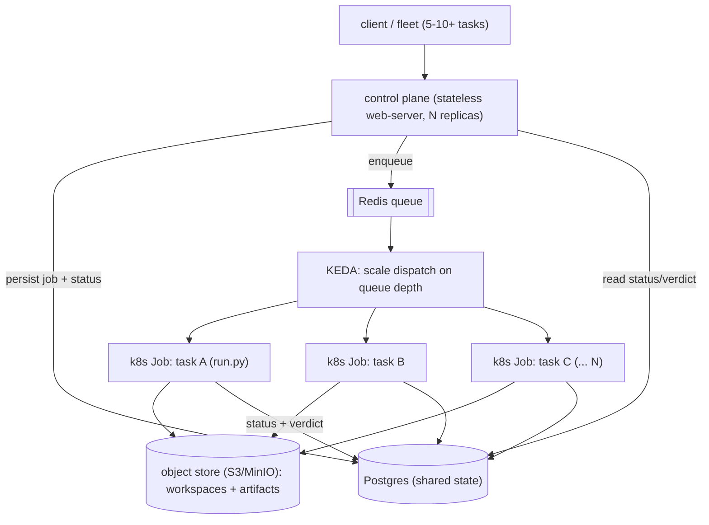

# RFC-0016 — Horizontal & Concurrent Execution

> **Status:** Proposed · **Created:** 2026-06-20 · **Extends:**
> [RFC-0005](./0005-environment-manifest-and-toolchain-provisioning.md)
> (per-task ephemeral sandbox / k8s Job — Tier A proven),
> [RFC-0002](./0002-task-contract.md) (contract is the job unit),
> [RFC-0006](./0006-verification-assurance-levels.md) (VAL),
> [RFC-0014](./0014-cost-aware-model-and-runtime-routing.md) (cost/budget →
> concurrency budget) ·
> **Affects:** PFactory, AIFactory, TFactory (execution model), Factory
> (shared-state + Job-dispatch conventions), platform (Postgres, object store,
> Redis/KEDA)

## 1. Motivation

The fleet is **single-instance by construction**. Live cluster + code audit
(2026-06-20) confirm: every service runs **1 replica**, HPA disabled, **no queue
or worker tier**, an in-memory task/session store, and a **`ReadWriteOnce`
`local-path` PVC** that cannot mount on a second pod. Deploys use
`maxSurge:0/maxUnavailable:1` — a brief full outage that also **kills in-flight
jobs**.

An enterprise needs **5–10+ concurrent tasks** (one team can submit that many at
once). Today that is impossible to do safely. This RFC defines how PFactory,
AIFactory, and TFactory scale to many concurrent jobs with isolation, backpressure,
and control-plane high-availability — reusing the **RFC-0005** per-task k8s-Job
substrate already proven (and TFactory's existing `kube_sandbox.py`).

## 2. Current state (audited)

| | Execution today | Concurrent in one pod | Primary blocker |
|---|---|---|---|
| **PFactory** | `process()` runs **synchronously inside the async handler**, single uvicorn process | ~1 (blocks the event loop, incl. `/health`) | sync-in-async single process + in-memory `_sessions` singleton |
| **AIFactory** | **OS subprocess per build** (`run.py`) | unbounded (uncapped) | `MAX_CONCURRENT_TASKS` is dead code; shared base-repo `.git` (no cross-process lock); one shared Claude token |
| **TFactory** | **OS subprocess per task** | unbounded (uncapped) | shared host resources: fixed ports, fixed container name `tfactory-run-{target}`, compose without per-task namespace; no backpressure |

Two assets to build on: (1) AIFactory + TFactory already isolate execution as a
**subprocess per task** — the hard part; (2) per-job *data* is largely isolated
(unique `mkdtemp`, per-spec workspaces, anonymous `--rm` containers). The blockers
are **shared singletons, shared host resources, admission control, and the single
RWO/1-replica deployment** — not deep rewrites.

## 3. Principles

1. **Stateless control plane, isolated execution.** The web-server accepts
   requests and serves status from shared storage; the actual job runs in an
   isolated unit (a k8s Job pod), never in the request's event loop.
2. **One job = one isolated unit.** Each task gets its own CPU/mem, network, and
   fresh workspace — no shared ports, container names, or `.git` index.
3. **Shared state is the enabler.** No service scales past one pod until per-pod
   in-memory state moves to a shared store (Postgres) and artifacts move off RWO
   local-path to object storage / RWX.
4. **Backpressure, not oversubscription.** A global admission cap + per-task
   resource requests; the scheduler bin-packs across nodes; a queue absorbs
   bursts. Never silently oversubscribe a pod into OOM.
5. **Reuse, don't reinvent.** Build on RFC-0005's k8s-Job sandbox and TFactory's
   `kube_sandbox.py`; fold concurrency cost into RFC-0014's budget.

## 4. Target architecture

- **Control plane** (per service): a thin, horizontally-scalable Deployment.
  Accepts API calls, writes the job + status to Postgres, enqueues work. Serves
  status/results by reading shared state — never blocks on execution. Multiple
  replicas safe because no in-memory job state.
- **Execution = k8s Job per task.** A dispatcher creates one Job per contract;
  the Job pod runs the existing `run.py` (AIFactory/TFactory) or PFactory
  `process()`, gets its own resources + network (no port/name/`.git` collisions),
  clones fresh, writes results to Postgres + object store, and exits. Reuses
  RFC-0005 substrate + TFactory `kube_sandbox` (`tfsbx-<uuid>`).
- **State**: Postgres for job/session/status (replaces `_sessions` /
  `running_tasks` dicts and the SQLite/emptyDir stores); object storage (S3/MinIO)
  or an RWX volume for workspaces + artifacts (replaces RWO local-path).
- **Autoscaling**: Redis queue + KEDA scales Job dispatch on queue depth; a global
  concurrency cap and per-task resource requests govern fan-out.

## 5. Per-service plan

- **PFactory** (furthest behind): (a) move `process()` off the event loop —
  immediately via `asyncio.to_thread`/process pool + admission cap; ultimately a
  Job. (b) Externalize `_sessions` → Postgres so `ingest`/`process`/`emit` can hit
  any replica. (c) Note: default planning is deterministic (no LLM) and light, so
  PFactory may run a thread/process-pool worker model rather than full Job-per-task
  if Jobs prove heavy for sub-second planning.
- **AIFactory** (closest): (a) wire the dead `MAX_CONCURRENT_TASKS` into real
  admission control. (b) Eliminate shared base-repo `.git` contention — clone or
  worktree-per-Job in an isolated checkout, or a cross-process git lock. (c)
  **Claude token pool** so concurrent builds don't collide on one OAuth token /
  rate limit. (d) `running_tasks` → Postgres. (e) `run.py` as a k8s Job.
- **TFactory**: (a) **dynamic/auto-free ports** (the `KubernetesRuntime
  local_port=0` path already exists — make it the default) + **per-task compose
  project namespace** + **per-task runtime container names** (replace fixed
  `tfactory-run-{target}`). (b) Admission control + per-task resource requests so
  N test containers don't exhaust the pod. (c) `run.py` as a k8s Job (extend
  `kube_sandbox`). (d) State → Postgres (replace SQLite emptyDir). This also
  mitigates [#464](https://github.com/olafkfreund/TFactory/issues/464): resource
  starvation under naive in-pod concurrency is a cause of lanes never reaching a
  verdict.

## 6. Phasing

1. **Phase 1 — Shared state + collision fixes + admission control.** Unblocks ~5
   concurrent now without the full Job model: Postgres-backed state, object/RWX
   artifacts, admission caps, PFactory event-loop offload, AIFactory `.git`/token
   fixes, TFactory ports/namespacing.
2. **Phase 2 — Control/execution split → Job-per-task.** Dispatcher + RBAC +
   result-callback convention; `run.py`/`process()` wrapped as k8s Jobs (reuse
   RFC-0005 + `kube_sandbox`). Control plane scales to N replicas. Deploys stop
   killing running jobs.
3. **Phase 3 — Autoscaling + concurrency budget.** Redis + KEDA scale on queue
   depth; global cap + per-task resources; concurrency cost folded into RFC-0014.

## 7. Verification

- **Concurrency proof:** submit 5–10 tasks simultaneously across the fleet; assert
  each runs in its own Job pod, no port/container/`.git` collisions, all reach a
  terminal state, and control-plane `/health` stays responsive throughout.
- **HA proof:** roll the control-plane Deployment mid-run; in-flight Jobs survive
  (detached) and results still land in Postgres/object store.
- **Backpressure proof:** submit beyond the cap; excess queues (no OOM), KEDA
  scales out, queue drains.

## 8. Adoption (tracked by the epic)

Factory: shared-state + Job-dispatch conventions, object-store interface, RBAC,
concurrency-budget tie-in. PFactory/AIFactory/TFactory: state externalization,
collision fixes, admission control, `run.py`/`process()` as Jobs. Platform:
Postgres, object storage, Redis, KEDA. Plus the concurrency/HA/backpressure E2E
proofs.
