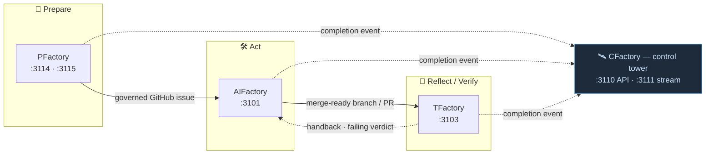
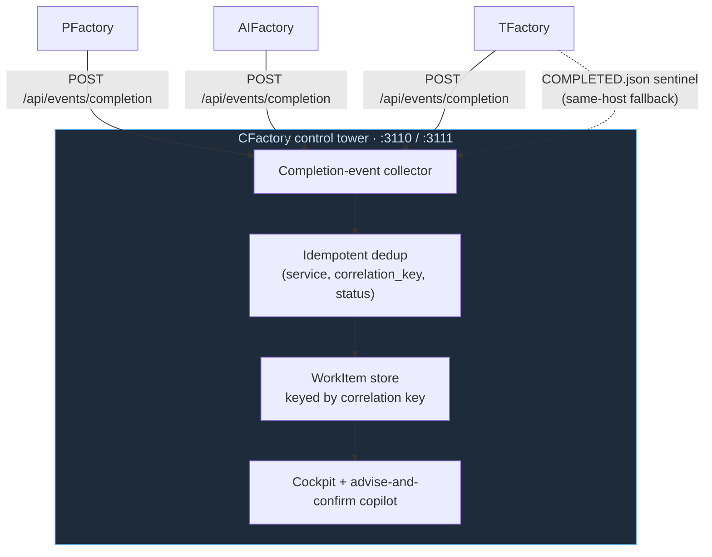

# Architecture

Factory itself is a **program / meta repository** — it ships documentation, RFCs and
cross-cutting plans, not running software. Its "architecture" is therefore the
**PARR pipeline**: how four independent products hand work off to one another and how
a single unit of work is threaded across the family.

## The PARR pipeline

**P**repare · **A**ct · **R**eflect · **R**eview — one stage per product, each useful
on its own, each designed to hand off to the next.



*Prepare → Act → Reflect run left to right; the dotted return arrow is the
TFactory→AIFactory handback. Every stage emits a completion event to CFactory,
which observes and steers the whole pipeline from the side.*

| Stage | Product | Inputs → Outputs |
|---|---|---|
| Prepare | **PFactory** | plan (docx/pdf/md, MCP, issue) → enrich (live cloud/Backstage) → review gates (cited) → human approval → **governed GitHub issues** |
| Act | **AIFactory** | governed issue → spec → code in isolated worktree → QA → **merge-ready branch / PR** |
| Reflect | **TFactory** | finished feature on a branch → generate + run tests across modality lanes → **5-signal verdict + triage report** |
| Review | **CFactory** | reads completion events + state from all three → **one cockpit `WorkItem` view + advise-and-confirm copilot** |

## The handoff chain

1. **PFactory → AIFactory.** PFactory emits governed GitHub issues; AIFactory picks
   them up and builds, carrying the issue number as provenance.
2. **AIFactory → TFactory.** A finished feature on a branch is handed to TFactory,
   which generates and grades a test suite against the acceptance criteria.
3. **TFactory → AIFactory (handback).** When tests fail, TFactory routes a correction
   request back to AIFactory's QA fixer — a bounded, closed loop.
4. **CFactory over everything.** A shared correlation key threads
   `plan → code → branch/PR → tests`, so CFactory can show and steer the whole
   pipeline from one place.

## The PARR spine (the connective tissue)

The spine is what lets the four products cooperate. It has three parts, all owned by
this repo:

- **A shared correlation key** — the **GitHub issue number** of the governed work
  item, threaded end to end:

  ```
  pfactory.session_id → issue# → aifactory.task_id → branch / PR# → tfactory.spec_id
  ```

  Before an issue exists, services emit a stable **synthetic key** (`pf-…`, `af-…`,
  `tf-…`) and reconcile to the real number once it is assigned. See
  [RFC-0001](api.md).

- **A normalized completion-event envelope** — every service emits **one** event when
  its stage reaches a terminal status, with six stable fields (`correlation_key`,
  `service`, `task_id`, `status`, `phase`, `updated_at`) plus optional additive
  `usage` and `correlation` blocks. Delivered best-effort over webhook (standard) or a
  same-host `COMPLETED.json` sentinel.

- **A canonical local port map** — fixed, non-overlapping ports so all four products
  run side by side and CFactory can reach them all:

  | Product | Backend port(s) | Stage |
  |---|---|---|
  | AIFactory | `3101` | Act |
  | TFactory | `3103` | Verify |
  | CFactory | `3110` (API) / `3111` (stream) | Cockpit |
  | PFactory | `3114` (API) / `3115` (frontend) | Plan |

  This resolved the historical `:3102` collision (PFactory and TFactory both claimed
  it); PFactory vacated to `3114/3115`, TFactory had already moved to `3103`, and
  `3102` is now free.

## Wiring the suite together

With the port map fixed, point each product's completion-event webhook at CFactory's
collector so all terminal events report to one cockpit, e.g. for PFactory:

```bash
PFACTORY_COMPLETION_WEBHOOK=http://localhost:3110/api/events/completion
```



Consumers (CFactory) treat events as **idempotent** by
`(service, correlation_key, status)` and must ignore unknown fields, so a new product
or a new field never forces a breaking change.

## Repository layout (this repo)

```
Factory/
├── catalog-info.yaml      # Backstage catalog: System factory-suite + Components + APIs
├── apis/                  # OpenAPI / AsyncAPI / MCP definitions (embedded via $text)
├── mkdocs.yml             # Backstage TechDocs config (docs_dir: techdocs)
├── techdocs/              # Backstage TechDocs (this site)
├── docs/                  # Jekyll site → https://factory.freundcloud.com/
│   ├── rfc/               # RFC-0001 (correlation key & completion event)
│   ├── roadmap.md         # program roadmap
│   ├── why.md             # positioning
│   └── dev/               # canonical port map & run-all guide
└── README.md
```

Program planning and cross-cutting epics live in
[Issues](https://github.com/olafkfreund/Factory/issues) and the
[Factory Program board](https://github.com/users/olafkfreund/projects/1).
