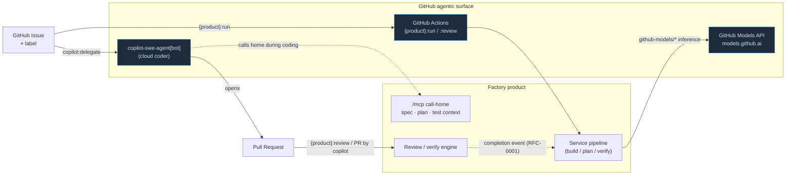

# GitHub Agentic Integration

Every Factory product integrates with **GitHub's native agentic surface** — the
Copilot cloud agent, the free GitHub Models inference API, MCP call-home for the
cloud agent, and Copilot automations in Actions. This page is the operator's view;
the canonical blueprint is
[**RFC-0003**](https://factory.freundcloud.com/rfc/github-agentic/).

## How a delegated unit of work flows

A Copilot-authored PR re-enters the normal PARR flow and is threaded by the same
[RFC-0001](https://factory.freundcloud.com/rfc/correlation-key/) correlation key as
any other work item.

## MCP call-home endpoints

During a coding session the cloud agent calls each product's existing MCP surface
for the context it would otherwise lack (canonical local port map):

| Product | MCP endpoint | What it serves the cloud agent |
|---|---|---|
| **AIFactory** | `:3101/mcp` | `aifactory_get_spec`, `aifactory_get_plan`, `aifactory_record_discovery` |
| **TFactory** | `:3103/mcp` | test context — acceptance criteria, the `tfactory` block from [RFC-0002](https://factory.freundcloud.com/rfc/task-contract/) |
| **PFactory** | `:3114/mcp` | planning context — enriched plan, governance constraints |

These are the same surfaces catalogued as each product's `*-mcp` API entity; the
cloud-agent config simply points GitHub at them.

## Label taxonomy (the trigger contract)

| Label | Applied to | Effect |
|---|---|---|
| `copilot:delegate` | Issue | Hand the issue to `copilot-swe-agent[bot]`; the product watches for the resulting PR |
| `aifactory:run` | Issue | AIFactory runs its build pipeline |
| `aifactory:review` | PR | AIFactory's PR-review engine reviews the PR |
| `pfactory:run` | Issue | PFactory enriches/decomposes into a governed plan |
| `tfactory:run` | Issue / PR | TFactory generates and grades tests |

These five labels exist in every repo and mean the same thing everywhere.

## GitHub Models provider

A `github-models` alias routes through each product's existing OpenAI-compatible
backend with GitHub defaults injected — `base_url = https://models.github.ai/inference`,
`api_key = $GITHUB_TOKEN`, and the `github-models/` prefix stripped from the model
string. In Actions this is free inference with no extra billing. Browse available
models at [`models.github.ai/catalog/models`](https://models.github.ai/catalog/models).

## Actions workflows

Three workflow shapes per product, keyed on the label taxonomy:

- `on: issues.labeled [{product}:run]` → the product's `from-github-issue` entry.
- `on: pull_request.opened` where `actor == copilot-swe-agent[bot]` → the product's
  review/verify engine on the Copilot PR.
- `on: pull_request.labeled [{product}:review]` → review engine on demand.

Supplemented by GitHub's native **Copilot Automations** (GA 2026-06-02) for
scheduled and event-triggered runs.

## Adoption status

Shipped across all three product repos — epics
[AIFactory#456](https://github.com/olafkfreund/AIFactory/issues/456),
[PFactory#87](https://github.com/olafkfreund/PFactory/issues/87),
[TFactory#277](https://github.com/olafkfreund/TFactory/issues/277) — all closed.

## See also

- [RFC-0003 — GitHub Agentic Integration](https://factory.freundcloud.com/rfc/github-agentic/) (canonical blueprint)
- [RFC-0002 — Task Contract v2](https://factory.freundcloud.com/rfc/task-contract/) (what the cloud agent reads via call-home)
- [RFC-0001 — correlation key & completion event](https://factory.freundcloud.com/rfc/correlation-key/) (how a Copilot PR is threaded)
- [API & Contracts](api.md) · [Architecture](architecture.md)
