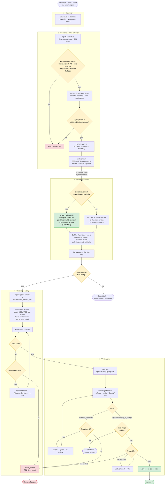
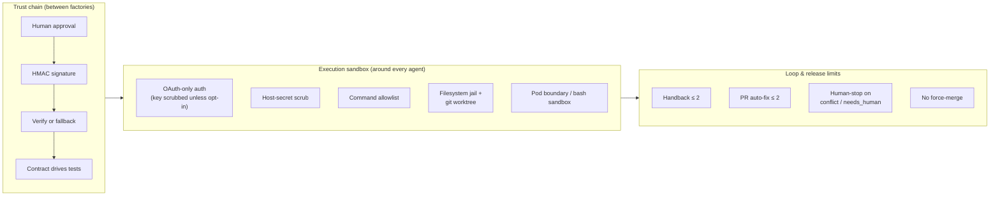
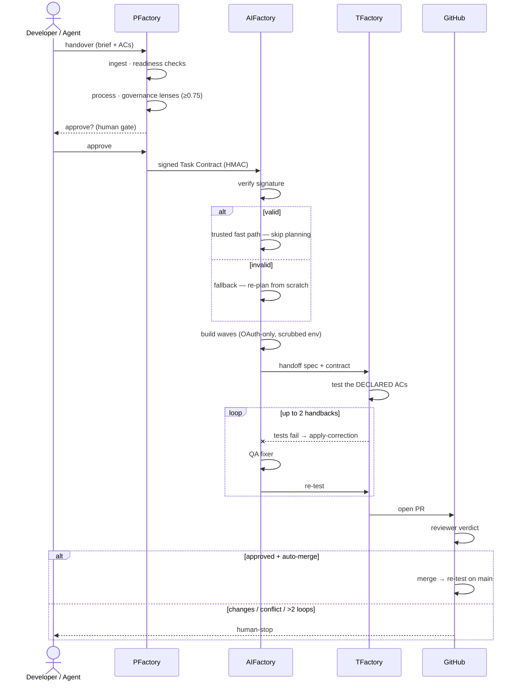

# The Factory PARR Pipeline — Steps, Decisions & Guards

> How a unit of work travels from a **handover** through **PFactory** (plan &
> govern) → **AIFactory** (build) → **TFactory** (verify) → a **reviewed,
> merged PR** — and exactly where and why execution is *guarded* at every hop.
>
> PARR = **P**lan · **A**ct · **R**eview · **R**elease. Each factory owns one
> stage; a signed contract carries trust between them; humans stay in control at
> the decisions that matter.

---

## 1. The big picture — end to end, with every decision gate

---

## 2. The guards — what is protected, why, and how

Every arrow above is cheap; every **diamond** is a guard. This is where "vibe
coding" becomes a governed process.

| # | Guard | Why it exists | How it's enforced |
|---|-------|---------------|-------------------|
| G1 | **Acceptance criteria required** | You can't verify what you didn't specify | PFactory `ingest` hard-fails a brief with no `## Acceptance Criteria`; every AC must map to a child issue |
| G2 | **Governance lenses** (security, feasibility, cost, architecture) | Catch risk *before* code exists, not in review | `process` scores each lens; aggregate must clear **0.75** and have **no blocking findings**, or approval is refused |
| G3 | **Live-infra / access checks** | Don't promise cloud actions you can't perform | Readiness check flags unverified IAM/cloud actions (e.g. `eks:CreateCluster`); soft/waivable when air-gapped, surfaced not hidden |
| G4 | **Human approval** | A person owns the go/no-go | `approve` records the approver + a plan-hash; nothing is signed until then |
| G5 | **HMAC-signed Task Contract** | Tamper-proof handover; downstream trusts *content*, not the caller | `emit-contract` signs the canonical plan+approval with a per-authority shared key (RFC-0002 v2) |
| G6 | **Signature verification + fallback** | A forged/edited contract must not skip planning | AIFactory verifies the signature; **valid → trusted fast path**, **invalid → safe fallback** (re-plan from scratch) — never silently trusts |
| G7 | **OAuth-only auth** | Agents must not silently bill a raw API key | `core/auth.py` scrubs `ANTHROPIC_API_KEY` from agents by default; direct-key billing is **opt-in** via `AIFACTORY_ALLOW_API_KEY` |
| G8 | **Agent env scrub** | A prompt-injected agent can't exfiltrate host secrets | Control-plane tokens, DB URLs, cloud creds, provider keys are blanked from the agent's subprocess env |
| G9 | **Command allowlist + filesystem jail** | Limit blast radius of generated/automated commands | Per-stack dynamic allowlist; FS ops restricted to the workspace/worktree; bash isolated by pod boundary (+ sandbox where supported) |
| G10 | **Worktree isolation** | One build can't corrupt another or the user's tree | Each spec builds in its own git worktree on its own branch; merge only on explicit action |
| G11 | **Declared-AC testing** | TFactory tests what was *promised*, not what it guesses | The contract's `tfactory` block (lanes/frameworks/`ac_to_code_map`) drives test generation — authoritative over inference |
| G12 | **Bounded handback loop** | Self-correction must not loop forever / burn budget | TFactory→AIFactory `apply-correction` is capped (default **≤2** cycles) → then terminal `needs_human` + RFC-0001 event |
| G13 | **Reviewer-gated merge** | Nothing merges unreviewed | Merge requires the configured reviewer's verdict (AIFactory engine / Copilot / any); changes-requested triggers a bounded auto-fix loop |
| G14 | **Never force-merge** | Protect `main` from unsafe automation | On a true conflict the bot tries `update-branch` once, then **stops for a human**; it never uses `--force` |
| G15 | **Full audit trail** | Enterprises need provenance | Every transition emits RFC-0001 events aggregated in the CFactory cockpit, keyed by `correlation_key` |

---

## 3. Trust & security — defense in depth around every agent run

**Two independent layers.** The *trust chain* governs what crosses factory
boundaries (a signed, human-approved contract). The *execution sandbox* governs
what a single agent can do on a machine (no secrets, no arbitrary commands, no
escaping its workspace). Even a fully compromised agent prompt is boxed by the
sandbox; even a forged contract is rejected by the trust chain.

---

## 4. The signed handshake + self-correcting verify loop (sequence)

---

## 5. Real-life user stories

Each story maps a **scenario** → the **guards that engage** → the **outcome**.

### 5.1 Individual — the solo builder / indie hacker

> **Maya** maintains three side-projects alone. She has a Claude subscription,
> not an API budget.

- **Scenario:** Friday night, Maya types `/handover "add CSV export to the
  reports page, must stream large files, cover with tests"` and goes to dinner.
- **Guards that engage:** OAuth-only auth means her subscription is used, never
  a metered API key (**G7**); the build runs in an isolated worktree so her main
  branch is untouched (**G10**); TFactory tests the streaming AC she declared
  (**G11**); the PR is opened but **left open** because she hasn't enabled
  auto-merge (**G13/G6 default-safe**).
- **Outcome:** Saturday morning there's a green PR with tests waiting for a
  30-second review. No surprise bills, no broken main, no babysitting.

### 5.2 Developer in a team — the feature handoff

> **Raj** is a backend dev on a 6-person squad. He's blocked waiting on a
> frontend change he doesn't have context for.

- **Scenario:** Raj writes a short brief with ACs ("clicking *Retry* re-issues
  the failed request and shows a toast") and hands it to PFactory instead of
  context-switching.
- **Guards that engage:** PFactory forces real ACs (**G1**) so the intent is
  unambiguous; the architecture lens checks it fits the existing component model
  (**G2**); the contract carries an `ac_to_code_map` so TFactory writes the exact
  UI test (**G11**); a bounded handback fixes a flaky selector automatically
  (**G12**) without pulling Raj back in.
- **Outcome:** Raj stays in flow on his own work; the frontend change lands as a
  reviewed PR he can sanity-check, not a half-finished branch he has to adopt.

### 5.3 A team / squad — parallel sprint execution

> **A platform squad** runs a sprint with 12 stories, 4 of them independent.

- **Scenario:** The lead approves a multi-service epic in PFactory; the contract
  declares 4 parallel build waves.
- **Guards that engage:** the readiness check proves the dependency graph is
  **acyclic** before any code (**G1**); workers are capped so parallelism can't
  thrash (**execution profile**); each story builds in its own worktree so they
  can't collide (**G10**); the CFactory cockpit shows every story's live stage by
  `correlation_key` (**G15**); the one story that fails tests cleanly hits
  `needs_human` instead of merging broken (**G12/G13**).
- **Outcome:** Four stories merge themselves with passing tests overnight; the
  squad's standup is about the *one* exception, not status-reporting twelve.

### 5.4 Enterprise — Factory as the governed build process

> **A regulated fintech** wants AI-assisted delivery *without* losing change
> control, auditability, or security posture.

- **Scenario:** Engineering adopts the Factory suite as the standard path from
  ticket to merge. Policy: security gate is mandatory; every change is
  human-approved at the plan stage and reviewer-gated at merge; nothing
  auto-merges to protected branches.
- **Guards that engage:** the **security lens + threshold** blocks risky plans
  before code exists (**G2**); **human approval** with recorded approver +
  plan-hash gives a change-control record (**G4**); the **HMAC contract** makes
  every build traceable to a signed, approved plan (**G5**); **OAuth-only / env
  scrub / allowlist / FS jail** mean agents can't leak secrets or run arbitrary
  commands (**G7–G9**); **never-force-merge** + reviewer gate protect `main`
  (**G13/G14**); the **RFC-0001 audit trail** in CFactory is the evidence for an
  auditor (**G15**).
- **Outcome:** AI does the implementation toil; the *process* — approval gates,
  signed provenance, security thresholds, sandboxed execution, audit trail —
  is enforced by the tool, not by hope. Adoptable as a compliance-friendly SDLC.

### 5.5 Enterprise variant — API-key billing org

> A larger org bills via a direct Anthropic API key (volume contract), not
> individual subscriptions.

- **Scenario:** Platform team sets `AIFACTORY_ALLOW_API_KEY=1` on the deployment.
- **Guards that engage:** the auth gate (**G7**) flips from *scrub* to *permit*
  — the key becomes a valid auth source and is passed through to agents — while
  every *other* guard (signing, sandbox, gates, audit) is unchanged.
- **Outcome:** the same governed pipeline, billed the way the enterprise's
  contract requires — a one-flag policy choice, not a fork.

---

## 6. Why this matters

Without the guards, "let an agent build it" is a liability: unbounded loops,
leaked secrets, unreviewed merges, no provenance. The Factory turns it into a
**process**: a human-approved, cryptographically-signed plan; sandboxed,
OAuth-only execution; declared-AC verification with bounded self-correction; and
a reviewer-gated, never-force merge — all audited end to end. That is the
difference between *AI that writes code* and *AI you can adopt as how you ship*.
